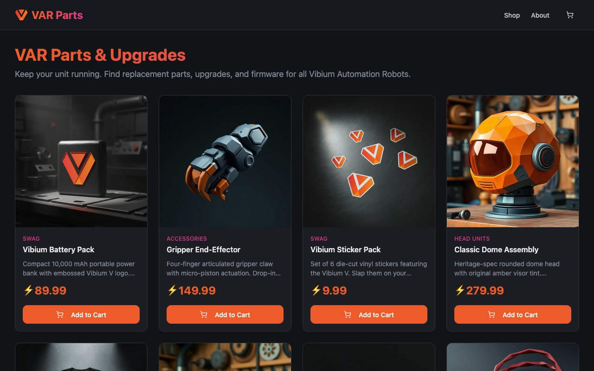

# Part 1: Check a live website

**Check tutorials:** Part 1 · [Part 2: Coding agents](check-with-a-coding-agent.md) · [Part 3: Recordings and traces](check-from-a-recording.md)

Check whether a website is up, then save the result, screenshots, and browser
actions in a recording. You don't need a coding agent or a test script.

## Before you start

You need Node.js with npm and a Vibium build that includes Check. Install
Vibium using the [installation instructions](../../README.md#agent-setup), then confirm:

```bash
vibium check --help
```

The shell examples use Bash or Zsh on macOS or Linux.
These tutorials describe the development build. If your installed version
has no `check` command, use the development binary supplied with your checkout
(`./clicker/bin/vibium`) in place of `vibium` below. Build instructions are
available for [macOS](../contributing/local-dev-setup-mac.md) and
[Linux](../contributing/local-dev-setup-x86-linux.md).

## 1. Configure AI access

Run and Check use Vibium's own model configuration. Your coding agent's
subscription does not configure it automatically. This example uses OpenAI;
for other providers, use the [provider guide](../reference/model-providers.md).

If you already have working settings, keep them and load them below.
Otherwise, create a private settings file:

```bash
vibium config init
# Wrote /Users/you/.config/vibium/ai.env (0600) — provider, model and API key for run and check
# Edit it, then: source /Users/you/.config/vibium/ai.env
```

That writes a commented file readable only by you. Open
`~/.config/vibium/ai.env` in your editor and set:

```bash
export VIBIUM_AI_PROVIDER=openai
export VIBIUM_AI_MODEL=gpt-5.6-sol
export VIBIUM_AI_REASONING_EFFORT=none
export OPENAI_API_KEY='replace-with-your-api-key'
```

Use a model your API account can access. This model uses `none` for tool calls;
other models may use different settings. Keep `export` on each line so the
settings reach Vibium, and keep your actual key in the file rather than chat
or project source code.

Load the file in the terminal you'll use for this tutorial:

```bash
source ~/.config/vibium/ai.env
vibium ready
```

Wait for browser installation and AI checks to pass. Readiness checks browser
files without opening a browser. If one is missing, run the suggested
`vibium install` command, then retry. Other failures also include a suggested fix.
Vibium does not load the file automatically, so source it again in each new
shell. These shared settings work for both Run and Check.

## 2. Check a website

```bash
vibium check "https://var.parts is up"
```

A browser opens and the result appears in your terminal. This Firefox run
on September 7, 2026 returned:

```text
CHECK: https://var.parts is up

PASS

https://var.parts is up and serving its storefront page.
- Navigation completed successfully at https://var.parts/.
- The page rendered with the title “Vibium Shop — VAR Parts & Upgrades,” navigation, product listings, images, and buttons.
```

**PASS** means the evidence supports the claim. **FAIL** means it contradicts
the claim. **INCONCLUSIVE** means the model couldn't decide. Your result may
differ; this is a small availability check, not a test of every site feature.

A browser started by Check closes afterward. An existing Vibium browser stays
open. Add `--keep-open` to preserve a newly started browser too.

## 3. Save a recording

Repeat the check with `-o`:

```bash
vibium check "https://var.parts is up" -o sitecheck.zip
```

You'll get the verdict and evidence again, followed by:

```text
Recording saved to sitecheck.zip
```

Open [Record Player](https://player.vibium.dev) and drop the ZIP onto it.
Expand the **Check** group to inspect the result and browser actions, and step
through the screenshots. Use a new output filename for each run.

Here is var.parts after the Firefox check shown above:



Keep `sitecheck.zip` for Part 3.

## Optional: include video with Firefox

Once the browser from this exercise is closed, use Firefox beta for this
development build's video example:

```bash
vibium install --engine firefox --channel beta
vibium check "https://var.parts is up" -o sitecheck-firefox.zip --engine firefox --channel beta
```

If you used `--keep-open`, close that browser with `vibium stop` before switching
engines. An unrelated existing session should be preserved; finish this exercise
in a separate session if needed.

Firefox 154 or newer includes WebM video. Chrome currently records actions and
screenshots without continuous video. Record Player can play the video from
your ZIP.

<details>
<summary>Watch the var.parts check</summary>

This is the same Firefox run as the screenshot and PASS result above. The GIF
preview plays at normal speed with fewer frames; the WebM is the original browser video.


[Watch the original WebM video](../images/first-check-var-parts.webm).

</details>

Next, [use Check with your coding agent](check-with-a-coding-agent.md), or
[check the saved recording](check-from-a-recording.md).
